#   APRENDENDO CSharp - Primeiros Passos

# ScreenShot

## PRIMEIRO PASSO

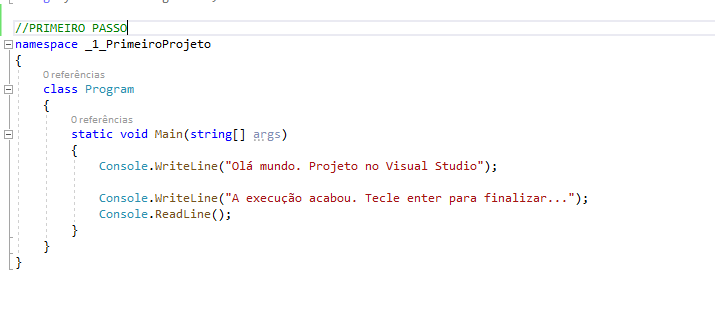

## CRIANDO VARIÁVEIS

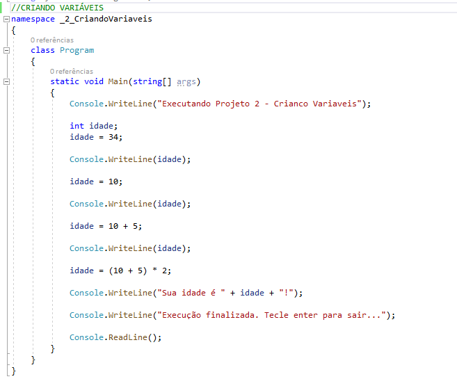

## CRIANDO VARIÁVEIS PONTO FLUTUANTE

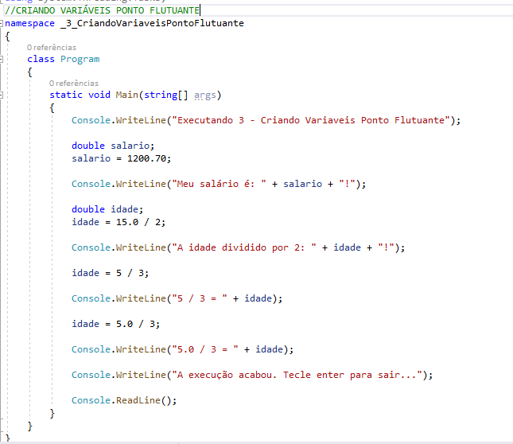

## CONVERSORES E OUTROS TIPOS NÚMERICOS

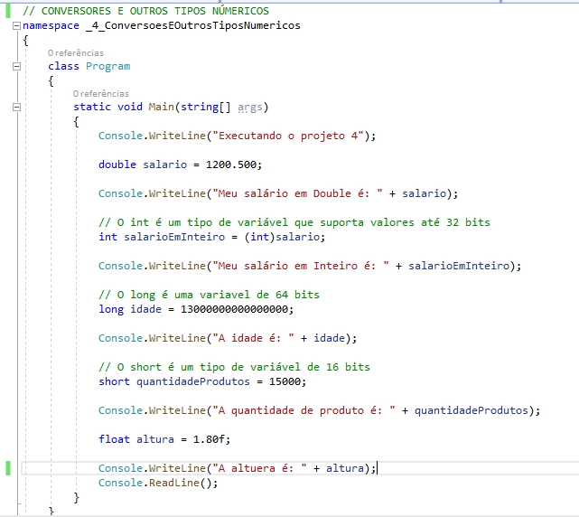

## CARACTERES E TEXTOS

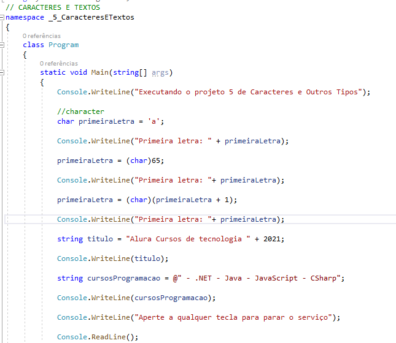

## ATRIBUIÇÕES DE VARIÁVEIS

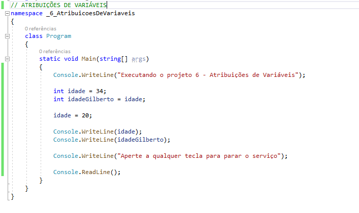

## CONDICIONAIS

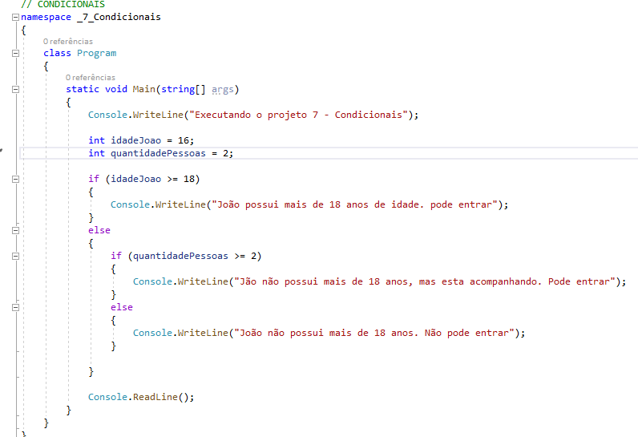

## CONDICIONAIS 2

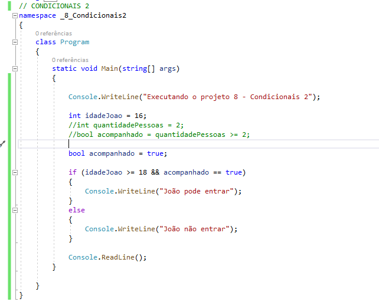

## ESCOPO

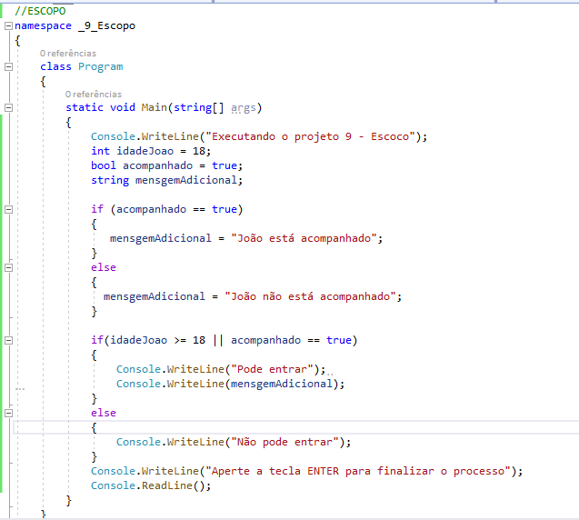

## SWITCH CASE

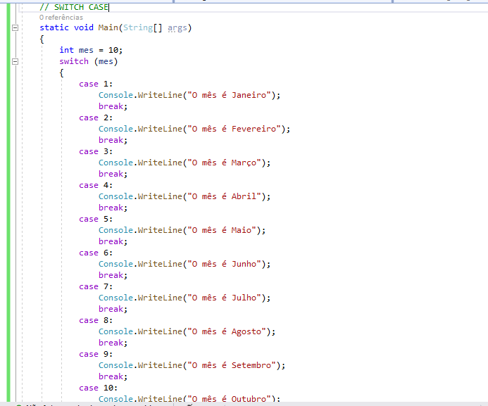

## LAÇO DE REPETIÇÃO WHILE

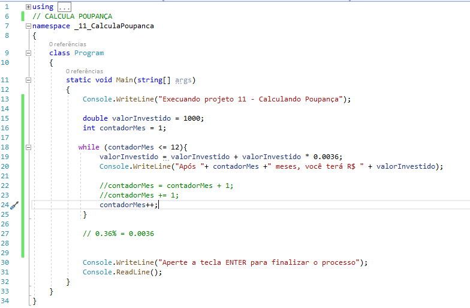

## LAÇO DE REPETIÇÃO FOR

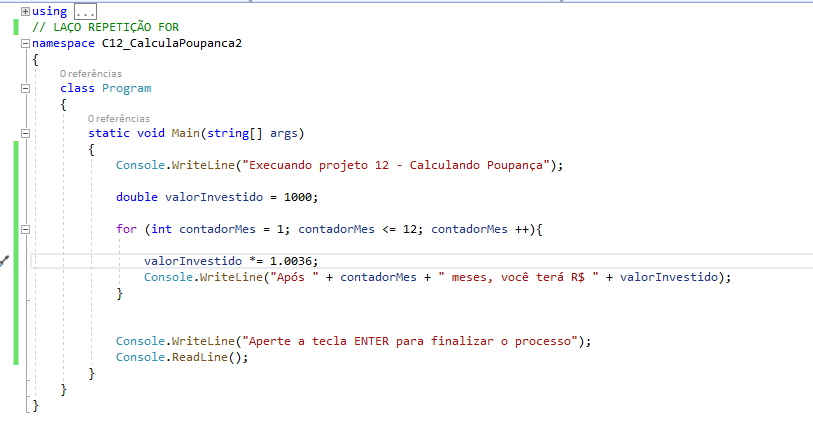

## ENCADEANDO LAÇOS FOR

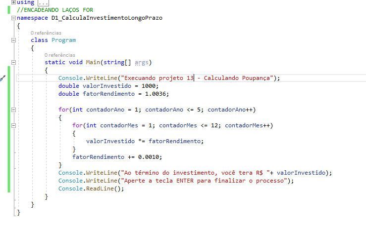

## A PALAVRA CHAVE BREAK

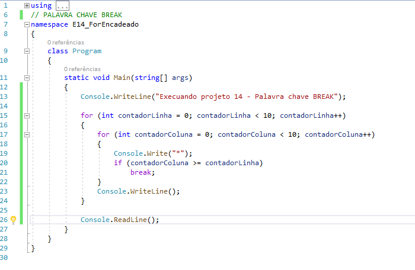

## NOVA FORMA DIFERENTE DE FAZER O ENCADEAMENTO

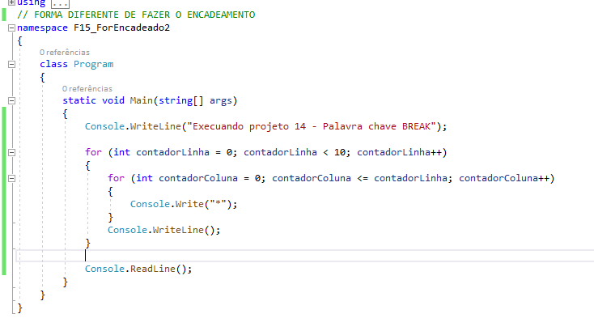

<!-- # CONCLUÍDO -->

<!-- 

 -->
<h1 align="center">💻 Desenvolvido Por: Gilberto Júnior</h1>
